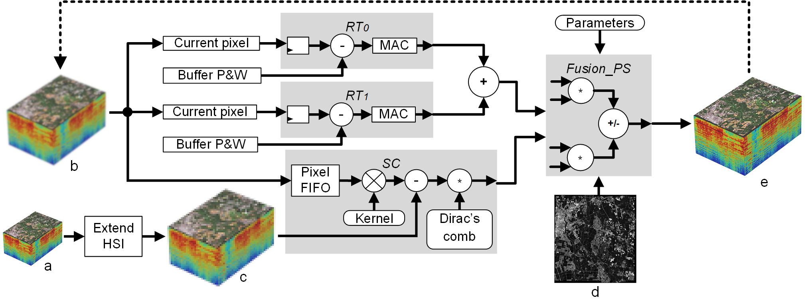

# A Hardware Accelerator for Onboard Spatial Resolution Enhancement of Hyperspectral Images

## Overview
This repository presents the code of a hardware accelerator designed to execute a pansharpening algorithm. This algorithm combines hyperspectral and panchromatic images to create an HSI with a higher spatial resolution. The hardware accelerator is both energy-efficient and suitable for onboard processing in small spacecraft, such as satellites.

## General Diagram

Fig: Diagram block of the proposed hardware accelerator based in Nonlocal Variant algorithm.

## Repository Organization
	- Hardware accelerator: VHDL base code to AMD/Xilinx FPGA Zynq family.
	- Software - Pansharpening NLV: Software used to design the hardware accelerator and the dataset used in tests.

## Prerequisites

- [AMD/Xilinx Vivado 2017.4](https://www.xilinx.com/support/download/index.html/content/xilinx/en/downloadNav/vivado-design-tools/archive.html)
- [CLion 2019](https://www.jetbrains.com/pt-br/clion/)
- [GDAL](https://gdal.org/index.html)

## Citation

If you use this code in your research, we would appreciate a citation to the original paper:

	@ARTICLE{viel2021pansharpening,
      author={Viel, Felipe and Parreira, Wemerson Délcio and Susin, Altamiro Amadeu and Zeferino, Cesar Albenes},
      journal={IEEE Geoscience and Remote Sensing Letters}, 
      title={A Hardware Accelerator for Onboard Spatial Resolution Enhancement of Hyperspectral Images}, 
      year={2021},
      volume={18},
      number={10},
      pages={1796-1800},
      doi={10.1109/LGRS.2020.3009019}}

## Acknowledgement

Software base used and modified to Hyperspectral Images is from a implementation Implementation of Nonlocal Pansharpening Image Fusion by [Duran et al.](https://doi.org/10.5201/ipol.2014.98).
   
## License

Copyright (c) 2023 Felipe Viel. Released under the MIT License. See [LICENSE](LICENSE) for details.
